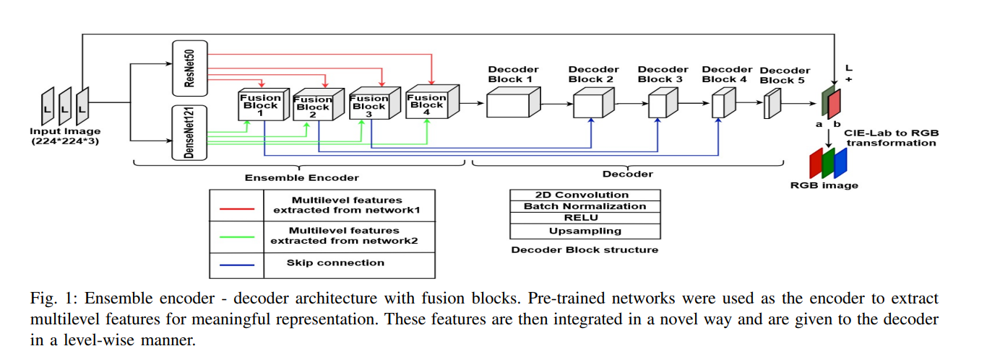

# ColorSAR: SAR Image Colorization

## SAR Image Colorization using Deep Learning

### Project Overview
This project aims to develop a deep learning model for colorizing grayscale Synthetic Aperture Radar (SAR) images. SAR images are typically represented in grayscale and lack the natural color information present in standard optical images. Our project enhances the interpretability of these images by converting them into colorized versions, which are useful for applications such as geological studies, environmental monitoring, and surface feature analysis.

#### **What are SAR Images?**
Synthetic Aperture Radar (SAR) images are produced by radar systems that utilize microwave signals to create detailed images of the Earth's surface. Unlike traditional optical imaging, SAR operates independently of sunlight and can penetrate through clouds, providing valuable data for various remote sensing applications. However, SAR images are generally monochromatic and do not convey color information, which can limit their usability in certain analyses. Colorization can help reveal features that are not easily distinguishable in grayscale images, improving interpretability and analysis.

### **Model Architecture**

### **Project Workflow**

### Repository Files
- `Our_Research` folder contains the methods and our work/implementation on different parts during the project implementation.
- `ML_PROJECT_P2.ipynb` is the submission of phase 2 of our project.
- `ColorSAR_Project_Report.pdf` is the report file of our project phase 2 submission.
- `original_model.ipynb` contains the implementation of **Training-1** as shown in the above workflow.
- `gray_model.ipynb` is the implementation of **Training-2** as shown in the above workflow.
- Other files contain the changes we try in the original model architecture as mentioned in the paper.

#### **Step 1: Load and Slice Images into Patches**
- The SAR images are loaded from the dataset and divided into smaller patches. This allows the model to focus on localized details, improving the accuracy of colorization.

#### **Step 2: Convert Patches to Lab Color Space**
- The grayscale image patches are converted to Lab color space. This enables the model to work with the **a** and **b** channels, which represent the chromaticity information needed for colorization.

#### **Step 3: Combine and Load Data**
- The processed image patches are merged and loaded into batches. This optimizes memory usage and ensures efficient training of the model.

#### **Step 4: Implement the Encoder and Decoder**
- The encoder extracts important spatial and texture features from the SAR images, while the decoder maps these features to the **a** and **b** channels, resulting in colorized images.

#### **Step 5: Training**
- The model is trained using the prepared dataset. Various hyperparameters are adjusted to optimize the learning process and improve the accuracy of colorization.

#### **Step 6: Prediction**
- After training, the model generates colorized images by predicting the chromatic information for each patch.

#### **Step 7: Evaluation**
- The model's predictions are evaluated using several metrics. These include both quantitative measures and visual inspection to ensure that the colorized images are accurate and aesthetically pleasing.

### **Model Comparison**

In this section, we compare the results of two different trained models. Each model has been evaluated based on its performance in colorizing the SAR images. Below are the images produced by each model, showcasing the differences in colorization quality and accuracy.

#### **Model 1 (Training-1): Trained on L and AB Channels of Original Color SAR Images**

*This model was trained using both the **L** (luminance) and **AB** (chrominance) channels of original color SAR images as input-output pairs. As a result, the colorization output is highly accurate, demonstrating that this model effectively captures the underlying color information. The successful performance in this model proves the efficacy of the colorization approach.*

#### **Model 2 (Training-2): Trained on L Channel of Noisy, Uncolored SAR Images (Post-Denoising) with AB Channel of Original Color SAR Images**

*In this model, training was conducted on the **L** channel of noisy, uncolored SAR images after applying denoising, combined with the **AB** channel of original color SAR images as input-output pairs. Consequently, while the color prediction remains fairly good, the overall results do not match the original due to the noise present in the **L** channel. This noise has impacted the preservation of structural definition in the images, leading to less accurate representations compared to Model 1.*

Note: More results can be seen in the images folder.

## **Evaluation**
We have evaluated on the following metrics:

### Peak Signal-to-Noise Ratio (PSNR)
**Definition**: PSNR measures the similarity between the denoised image and the ground truth, in terms of pixel intensity values. It is expressed in decibels (dB).

**Interpretation**:
- A higher PSNR value indicates better reconstruction quality (less error between the denoised and clean images).

**Typical ranges for PSNR**:
- \>30 dB: Excellent quality (almost indistinguishable from the ground truth).
- 25–30 dB: Good quality, some perceptible noise.
- <25 dB: Noticeable degradation in quality.

### Structural Similarity Index (SSIM)
**Definition**: SSIM measures the perceptual similarity between the denoised image and the ground truth, accounting for luminance, contrast, and structure.

**Range**: SSIM values range from 0 to 1, where:
- 1.0: Perfect match to the ground truth.
- 0.0: No similarity to the ground truth.

**Interpretation**:
- High SSIM (close to 1) means that the structural and visual content of the denoised image is very similar to the clean image.

**Values**:
- \>0.95: Excellent structural similarity.
- 0.85–0.95: Good similarity but some structural loss.
- <0.85: Noticeable structural degradation.

### **Model 1 Results:**: 
- **PSNR**: 29.9230
- **SSIM**: 0.9400

### **Model 2 Results:**
- **PSNR**: 14.4466
- **SSIM**: 0.2314

## **Comparison Summary**
- **Model 1** demonstrates superior color accuracy due to the use of original L channel, effectively proving the robustness of the colorization model.
- **Model 2**, while showing decent color predictions, suffers from structural fidelity issues caused by noise in the luminance channel, indicating that further refinement in denoising processes may be necessary for future iterations.

## **Future Work**
- **Improving Denoising**: Enhance the denoising techniques to reduce noise in the SAR images, ensuring cleaner inputs and more accurate colorization.
- **Extended Evaluation**: Perform a comprehensive evaluation using additional metrics and visual inspection to ensure high-quality results.
- **Final Predictions**: Generate the final set of colorized SAR images using the improved model.
 
### **Technologies Used**
- Python
- PyTorch
- NumPy
- OpenCV
- Matplotlib 
- Pillow
- Scipy Image

## Contributors
We thank the following people for their contributions to this project:
- [Nishchay Rajput](https://github.com/NishchayRajput)
- [Ojus Goel](https://github.com/ojusgoel)
- [Janmay Patel](https://github.com/janmay2910)
- [Aditya Bajpai](https://github.com/Aditya-117)
- [Nishant Verma](https://github.com/nishant9083)

## Acknowledgment
This project utilizes concepts and techniques from the following paper:

**Automatic Image Colorization using Ensemble of Deep Convolutional Neural Networks**  
Urvi Oza\*, Arpit Pipara†, Srimanta Mandal‡, and Pankaj Kumar§  
\*†‡ Dhirubhai Ambani Institute of Information Communication Technology (DAIICT), Gandhinagar, India  
\*201921009@daiict.ac.in, †201911030@daiict.ac.in, ‡in.srimanta.mandal@ieee.org  
§ University of Petroleum and Energy Studies (UPES), Bidholi, Dehradun, India  
pankaj.k@ddn.upes.ac.in
